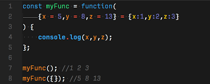

  

## For a beginner

When I began learning JavaScript, I felt it was very hard for me since I always wanted to type ‘var’ for my references, but now I know that I need to use ‘let’ or ‘const’ for all my references, which takes me more time to correct. I know that if I practice this language more, I will be more familiar with it. I really enjoy doing WODs; therefore, I want to do more WODs for this course since my professor gives the solution at the end of the class or practice problem which helps me learn more from it. Before I learned JavaScript, I thought that it was based on Java that I learned, but it is not true; they just have a similar name, but they have different uses for it. For example, Java is a statically typed language; JavaScript is dynamic.

## Learning
I think JavaScript is a fun material to learn in this course. I like the freeCodeCamp; it takes me a lot of time to do the assignment, but it is very helpful to me since it helps me know better about how JavaScript looks and how it runs. The new thing that I learned from ES6 are for…of, for…in and console.log(), but I am still a little bit confused about how to use it correctly. Overall, this ES6 is a very good material for a newbie since it gives example codes and explanation.

## Summary
In conclusion, I think JavaScript is a bad programming language from a software engineering perspective because JavaScript does not even have a proper integer type. But it is a good programming language for athletic software engineering since it focuses on basic programming concepts such as loops, array, etc.
