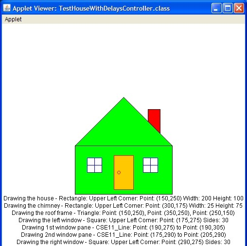

<div class="ui medium right floated rounded images">
  
</div>

This is my favorite code that I have written when I was doing this assignment from ICS 111 in KCC. In this assignment, my professor wants students creating shapes in java that can be any kind of shapes and colors. It is helping students to familiar with creating shapes in java.

It is my first time to creating shapes in java which makes me so excited at that time. In this code, I draw a house and had cloud on top of the house but the cloud can be move by zoom in or out.

From this assignment, I learned how to design Applet in java. I also want to learn how to make moving image in Applet in java. I fell there will be a lot of fun to draw different shapes and learned deeper knowlege for dessign Applet. 


Here is the code that I wrote: 
```js
import java.applet.*;
import java.awt.*;
import java.util.*;

public class Art extends Applet{
   int x = 40;
   int y = 30;
   int wh= 0;
   Random r = new Random( );
   
   public void paint(Graphics g){//drawing instructions go here
   
       //describe of drawing
      g.setColor(Color.black);
      Font f = new Font("Times Roman", Font.BOLD, 30);
      g.setFont(f);
      g.drawString("The gloomy day of code", 400, 100);
       
      g.setColor(Color.magenta);
      Font d = new Font ("Arial", Font.PLAIN, 40);
      g.setFont(d);
      g.drawString("The house of code", 400,300);
       
       //roof of the house
      Color myColor = new Color (103,191,59);
      g.setColor(myColor);
      g.drawLine(150,150,250,250);
      g.drawLine(50,250,150,150);
      g.drawLine(50,250,250,250);  
       
       //body of the house
      Color Color = new Color(255,0,0);
      g.setColor(Color);
      g.drawArc(100,375,100,150,0,45);
      g.drawArc(100,375,100,150,0,180);
      g.drawLine(150,450,150,375);
      g.setColor(Color.blue);   
      g.drawRect(50,250,200,200);
      
      g.setColor(Color.cyan);
      g.fillRect(90,280,50,50);
      g.fillRect(170,280,50,50);
      
      g.setColor(Color.gray);         
      for(int loop = 1; loop <= 20; loop++){
         wh = r.nextInt(50);
         wh = wh+20;
         x = r.nextInt(300)+25;
         y = r.nextInt(50)+55;
         g.fillOval(x,y,wh,wh);
      }
   }
}
```
