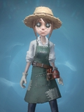

Identity V is my favorite game that I ever played. In this game, there are many characters, but we can divide it into two parts. The first part is called regulators and the second part is called survivors. The regulator's job is to catch survivors while survivors must breakout of five puzzles in order to survive the game. There are top three character that I often used.

  

My favorite character in this game is Emily; she is a doctor and has a treatment tool that helps to treat those who are injured. The tips to play this character is work with other people when doing the puzzles because you can treatment other immediately. Every time you treatment a survivor, your score  will be higher since it is main job of doctor.

  

  

The second character that I played most is Emma Woods; she is a gardener and has toolbox that can destroy the execution frame in the scene. The tips to play this character is only removing the entire chairs in the shortest possible time.

  

  

The last character that I played most is Freddy Riley; he is a lawyer and has a map that can help him to find where are the puzzles. The tips to play this character is find a partner and breakout of all puzzles.

## Conclusion
From this project, I learned how to designed a game and what kind of characters that the user will like since I have played this mobile game for a while. I also learned how to do the teamwork with others which will helps me to do teamwork with other people such as when I writing a code with classmates or coworkers. Therefore, I will played more games to help me realize that what kind the game users will play and more cooperate with others.
