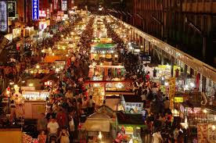

  

The night market is the most representative food culture in Taiwanese life. In this place, people can enjoy a variety of unique Taiwanese food and snacks, and you can find all the cheap and delicious food.

  

