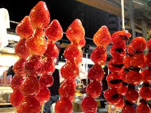

  

The night market is the most representative food culture in Taiwanese life. In this place, people can enjoy a variety of unique Taiwanese food and snacks, and you can find all the cheap and delicious food.

  

If I have a foreign friend coming to Taiwan, I will definitely take him/her to the night market and taste all the delicious food. There is a food called sugar coated haws on a stick which is my favorite food in night market. This food is what I must buy when I go to the night market. 

The ingredients for making this food are various fruits, bamboo sticks, ice water, and white sugar. The first step in making candied fruit is to clean the fruit and string it on the bamboo stick and dry it for use. The next step is to open the small fire and cook the syrup until the start of the burnt color. Shake the pot and let the syrup evenly. Finally, wrap the fruit in sugar and put it in ice water.
